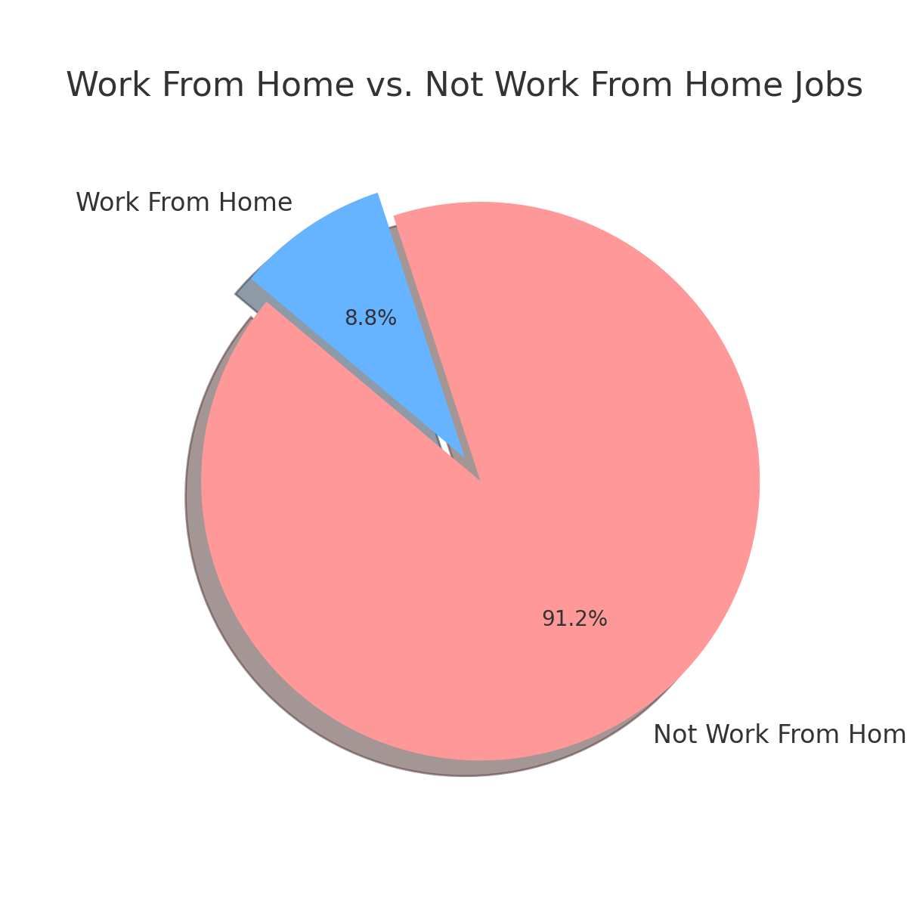
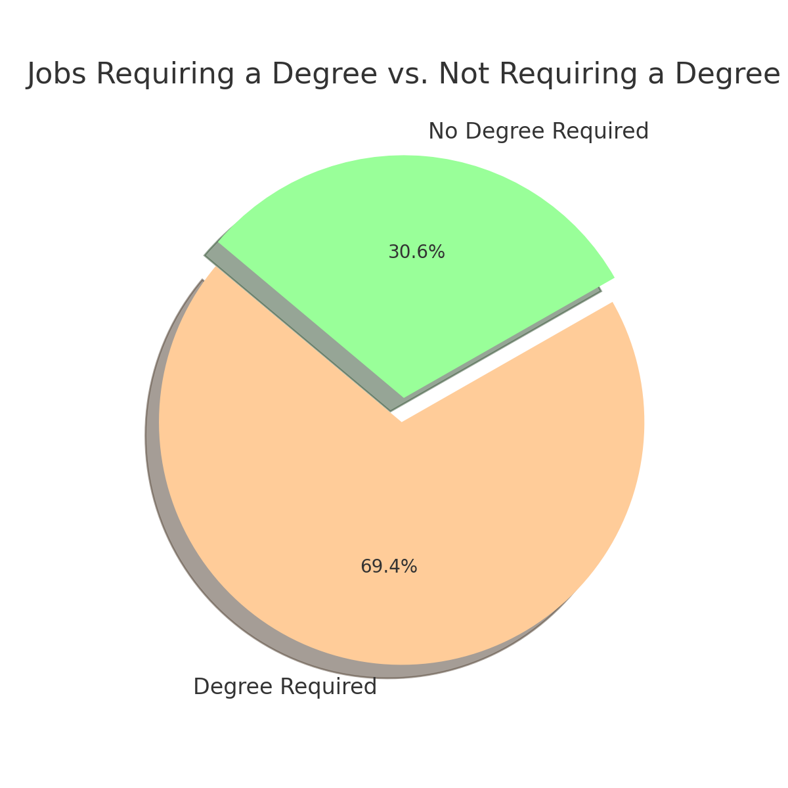
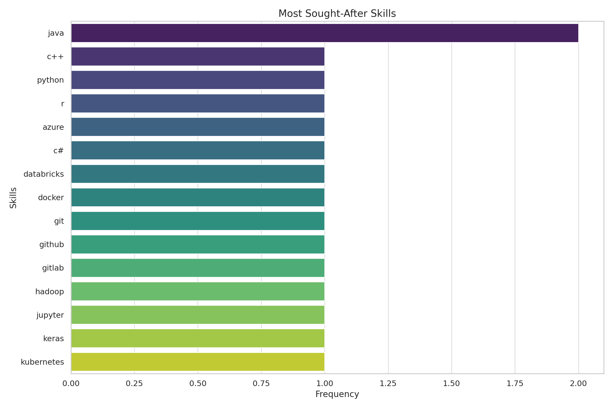
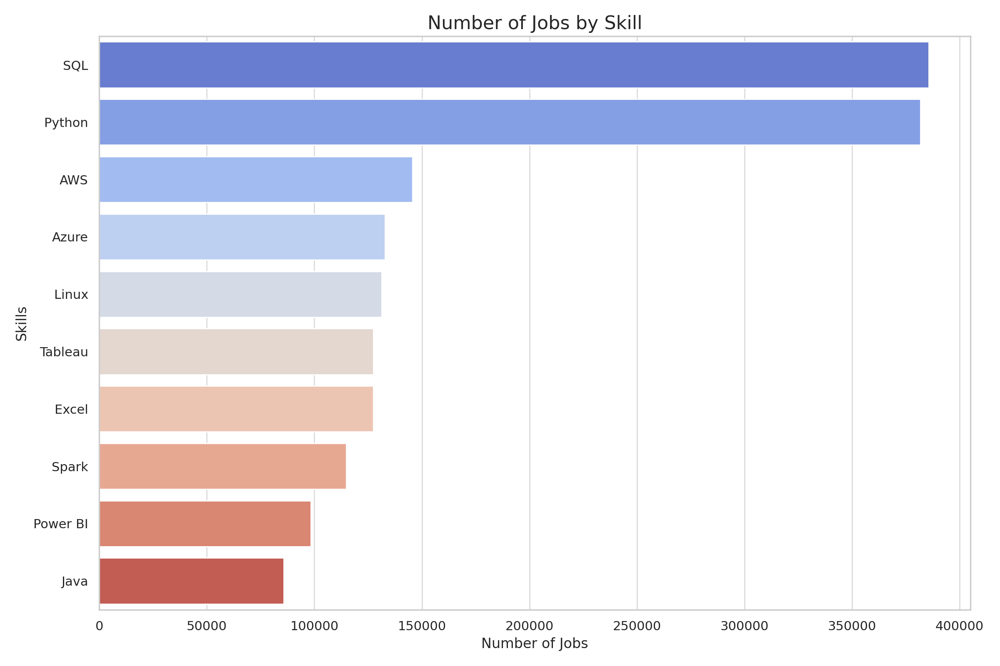
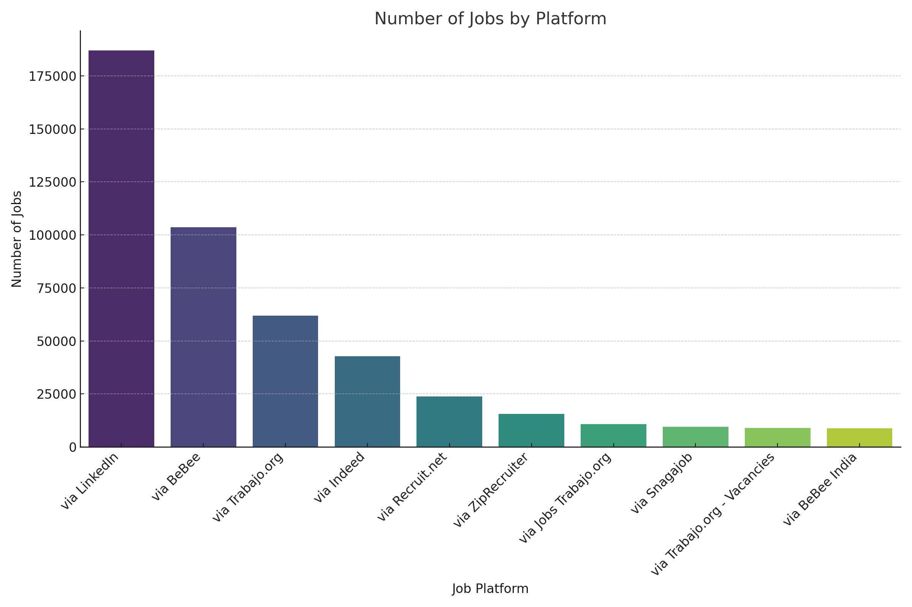
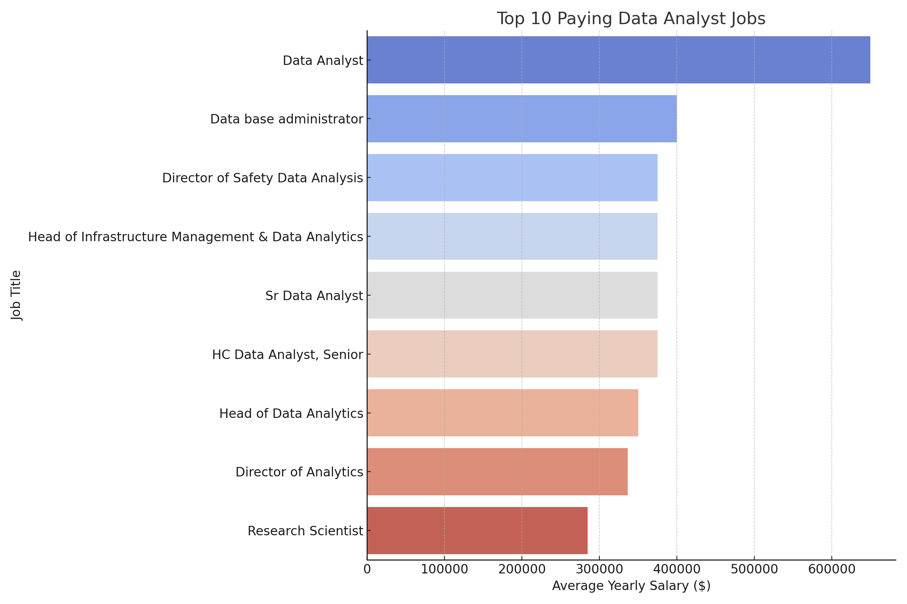
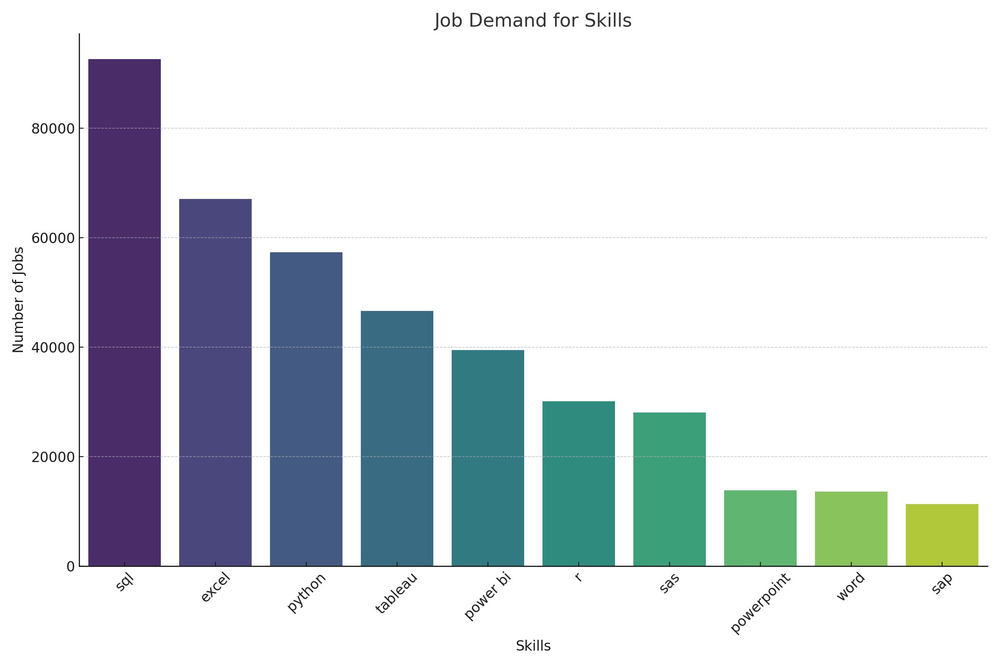
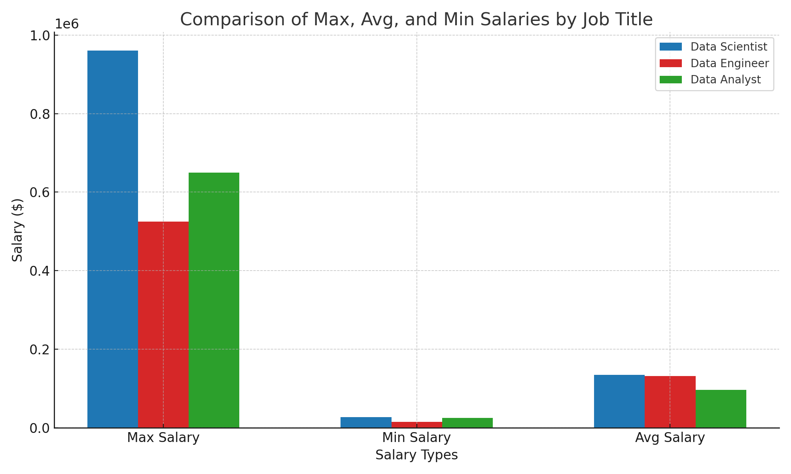

# Introduction 

📊 Welcome to my first SQL project, where I explore the dynamic world of the data job market with a special emphasis on data analysis roles. this project explores 💰 top-paying jobs, 🔥 in-demand skills, and 📈 where high demand meets high salary in data analytics.

The dataset encompasses over 700,000 job postings from around the globe in 2023.

[See the files](https://drive.google.com/drive/folders/11VW35EuY4hCdqyUaZ0cLFLMv8xjBAEPk)


## This analysis explores the following key areas:

1. Analyzing Number of Jobs and Percentage of Home Office and Jobs Not Requiring a Degree
2. Top-Paying Jobs and Skills for Those Jobs
3. Most In-Demand Skills and Search Trends
4. Job Sources
5. Top 10 Salaries for Data Analyst Positions
6. Top Skills for Data Analyst Positions
7. Salary Comparison for Data Analysts, Data Scientists, and Data Engineers
8. Average Salary for On-Site vs. Remote Jobs for Data Analysts
9. Impact of Degree Requirement on Job Count and Average Salary for Data Analysts

## Tools I Used

-  SQL:The backbone of my analysis, allowing me to query the database and unearth critical insights.
-  PostgreSQL: The chosen database management system, ideal for handling the job posting data.
- Visual Studio Code: My go-to for database management and executing SQL queries.
- Git & GitHub: Essential for version control and sharing my SQL scripts and analysis, ensuring collaboration and project tracking.

## The Analysis

Each query for this project aimed at investigating specific aspects of the data analyst job market. Here’s how I approached each question:

## 1. **Analyzing Number of Jobs and Percentage of Home Office and Jobs Not Requiring a Degree**

To understand the distribution of job opportunities, I analyzed the number of job postings that offer remote work and the percentage of positions that do not require a degree. This query provides insights into job flexibility and the importance of formal education in data analytics roles.
   

```sql
   SELECT 
    COALESCE(CAST(job_work_from_home AS TEXT), 'False') AS job_work_from_home,
    COUNT(job_id) AS number_of_jobs,
    ROUND(100.0 * COUNT(job_id) / (SELECT COUNT(*) FROM job_postings_fact ), 2) AS percentage
FROM 
    job_postings_fact
WHERE
    job_work_from_home IS NOT NULL 
GROUP BY 
    job_work_from_home

UNION ALL

SELECT 
    'TOTAL',
    COUNT(job_id),
    100.00
FROM 
    job_postings_fact;
    
```   
## Work From Home Job Distribution
### Data Table

| Work From Home | Number of Jobs | Percentage |
|---------------|--------------|------------|
| No (false)   | 718,080      | 91.16%     |
| Yes (true)   | 69,606       | 8.84%      |
| **Total**    | **787,686**  | **100%**   |


 *Pie chart visualizing the work-from-home job distribution*

### Key Insights:

*The majority (91.16%) of jobs do not offer work-from-home options.*

*Only 8.84% of jobs allow remote work, indicating a smaller proportion of remote opportunities.*

 ## Degree Requirement Analysis

To assess the impact of formal education, I also analyzed the number and percentage of job postings that do not require a degree.


```sql
SELECT 
    COALESCE(CAST(job_no_degree_mention AS TEXT), 'False') AS job_no_degree_mention,
    COUNT(job_id) AS number_of_jobs,
    ROUND(100.0 * COUNT(job_id) / (SELECT COUNT(*) FROM job_postings_fact ), 2) AS percentage
FROM 
    job_postings_fact
WHERE
    job_no_degree_mention IS NOT NULL
GROUP BY 
    job_no_degree_mention

UNION ALL

SELECT 
    'TOTAL',
    COUNT(job_id),
    100.00
FROM 
    job_postings_fact;
```

## Degree Requirement Data Table

| No Degree Required | Number of Jobs | Percentage |
|-------------------|--------------|------------|
| No (false)       | 546,329      | 69.36%     |
| Yes (true)       | 241,357      | 30.64%     |
| **Total**        | **787,686**  | **100%**   |



P*ie chart visualizing the jobs that do not require a degree:*

### Key Insights:

*69.36% of jobs require a degree, confirming that formal education is still a significant requirement in most positions.*

*30.64% of jobs do not require a degree, highlighting a sizable number of opportunities available without higher education.*


## 2. **Top-Paying Jobs and Skills for Those Jobs**
To identify the highest-paying roles in data analytics, I filtered job postings by average yearly salary and analyzed the most sought-after skills for these positions. This query highlights the most lucrative opportunities in the field and the key skills required for them.

```sql
SELECT
    job_postings_fact.job_title_short,
    job_postings_fact.salary_year_avg,
    skills_dim.skills
FROM
    job_postings_fact
LEFT JOIN skills_job_dim ON job_postings_fact.job_id = skills_job_dim.job_id
LEFT JOIN skills_dim ON skills_job_dim.skill_id = skills_dim.skill_id
WHERE
    job_postings_fact.salary_year_avg IS NOT NULL 
    AND skills_dim.skills IS NOT NULL
GROUP BY
    job_postings_fact.job_title_short,
    job_postings_fact.salary_year_avg,
    skills_dim.skills
ORDER BY
    job_postings_fact.salary_year_avg DESC
LIMIT 20;
```
## Top-Paying Data Analytics Jobs and Required Skills
   | Job Title            | Average Salary ($) | Most Sought-After Skills          |
|----------------------|---------------------|------------------------------------|
| Data Scientist       | 960,000            | C++, Java, Python, R              |
| Senior Data Scientist| 890,000            | Azure, C#, Databricks, Docker, Git, GitHub, GitLab, Hadoop, Java, Jupyter, Keras, Kubernetes |




### Key Insights:
*Data Scientist roles offer the highest average salary of $960,000, emphasizing the demand for advanced programming skills such as C++, Java, Python, and R.*

*Senior Data Scientist positions follow closely with an average salary of $890,000, requiring a broader skill set that includes cloud platforms, DevOps tools, and machine learning frameworks such as Azure, C#, Databricks, Docker, Git, Hadoop, Jupyter, and Kubernetes.*

## 3. **Most In-Demand Skills and Search Trends**
To identify the most sought-after skills in data analytics, I analyzed job postings to determine which skills appear most frequently. The following SQL query highlights the top 10 most in-demand skills based on job listings.

```sql
SELECT
    skills_dim.skills,
    COUNT(job_postings_fact.job_id) AS number_of_jobs
FROM
    job_postings_fact
LEFT JOIN skills_job_dim ON job_postings_fact.job_id = skills_job_dim.job_id
LEFT JOIN skills_dim ON skills_job_dim.skill_id = skills_dim.skill_id
WHERE
    skills_dim.skills IS NOT NULL
GROUP BY
    skills_dim.skills
ORDER BY
    number_of_jobs DESC
LIMIT 10;
```
## Top 10 Most In-Demand Skills

| Skills    | Number of Jobs |
|-----------|----------------|
| SQL       | 385,750        |
| Python    | 381,863        |
| AWS       | 145,718        |
| Azure     | 132,851        |
| Linux     | 131,285        |
| Tableau   | 127,500        |
| Excel     | 127,341        |
| Spark     | 114,928        |
| Power BI  | 98,363         |
| Java      | 85,854         |




*Bar graph visualizing the most popular skills for Data Analyst*

### Key Insights:
*SQL and Python are the two most in-demand skills, appearing in over 380,000 job postings, reinforcing their importance in data analytics.*

*Cloud platforms such as AWS and Azure are in high demand, reflecting the increasing shift towards cloud-based data solutions.*

*Business intelligence tools like Tableau and Power BI remain essential for data visualization and reporting.*

## 4. **Job Sources**
To understand where job seekers are finding job postings, I analyzed the job_via data. This query identifies the top 10 platforms where data analyst job postings are most frequently listed.

```sql
   SELECT
    job_via,
    COUNT(job_via) AS number_of_jobs
    FROM
    job_postings_fact
GROUP BY
    job_via
ORDER BY
    number_of_jobs DESC
LIMIT 10;
```
## Top 10 Job Posting Sources
   | Job Via                          | Number of Jobs |
|----------------------------------|----------------|
| via LinkedIn                     | 186,990        |
| via BeBee                        | 103,655        |
| via Trabajo.org                  | 61,935         |
| via Indeed                       | 42,835         |
| via Recruit.net                  | 23,714         |
| via ZipRecruiter                 | 15,612         |
| via Jobs Trabajo.org             | 10,690         |
| via Snagajob                     | 9,424          |
| via Trabajo.org - Vacancies      | 8,920          |
| via BeBee India                  | 8,705          |




*Bar graph visualizing the most popular job platforms for Data Analyst*

### Key Insights:
*LinkedIn is the dominant job source, accounting for nearly 187,000 job postings, making it the leading platform for data analyst roles.*

*BeBee and Trabajo.org follow as major sources, showing strong competition among job listing platforms.*

*Indeed, Recruit.net, and ZipRecruiter remain popular job search engines, reinforcing their importance in the job-seeking process.*

## 5. **Top 10 Salaries for Data Analyst Positions**
To identify the highest-paying roles, I filtered data analyst positions by average yearly salary. This query highlights the most lucrative opportunities in the field.
   

   ```sql
SELECT	
	job_id,
	job_title,
	job_location,
	job_schedule_type,
	salary_year_avg,
	job_posted_date,
    name AS company_name
FROM
    job_postings_fact
LEFT JOIN company_dim ON job_postings_fact.company_id = company_dim.company_id
WHERE
    job_title_short = 'Data Analyst' AND 
    
    salary_year_avg IS NOT NULL
ORDER BY
    salary_year_avg DESC
LIMIT 10;
```

### Top 10 Highest-Paying Data Analyst Roles


*Bar graph visualizing for top 10 Data Analyst salary*

### Key Insights:
*Significant Salary Variation – The highest-paying data analyst roles range from $184,000 to $650,000, reflecting diverse pay scales based on experience, location, and company size.*

*Top Employers – Companies like SmartAsset, Meta, and AT&T are among those offering the highest salaries, indicating strong demand for skilled analysts.*

*Role Diversity – High-paying roles span various titles, from Data Analyst to Director of Analytics, emphasizing specialization and leadership opportunities in data analytics.*

## 6. **Top Skills for Data Analyst Positions**

To understand the most in-demand skills for Data Analyst job roles, I analyzed job postings and ranked skills based on their frequency in job descriptions.

```sql
SELECT 
    skills,
    COUNT(skills_job_dim.job_id) AS job_count
FROM job_postings_fact
INNER JOIN skills_job_dim ON job_postings_fact.job_id = skills_job_dim.job_id
INNER JOIN skills_dim ON skills_job_dim.skill_id = skills_dim.skill_id
WHERE job_title_short = 'Data Analyst'
GROUP BY
    skills 
ORDER BY job_count DESC
LIMIT 10
```
## Most In-Demand Skills for Data Analysts
| skills     |   job_count |
|:-----------|------------:|
| sql        |       92628 |
| excel      |       67031 |
| python     |       57326 |
| tableau    |       46554 |
| power bi   |       39468 |
| r          |       30075 |
| sas        |       28068 |
| powerpoint |       13848 |
| word       |       13591 |
| sap        |       11297 |



### Key Insights:
*SQL Dominates – SQL is the most sought-after skill, appearing in over 92,000 job postings, highlighting its importance in data manipulation and querying.*

*Excel & Python – Excel and Python remain critical tools, emphasizing the need for both spreadsheet proficiency and programming skills.*

*Data Visualization Tools – Tableau and Power BI rank highly, reflecting the growing demand for data visualization expertise.*

## 7. **Salary Comparison for Data Analysts, Data Scientists, and Data Engineers**
Understanding salary differences between Data Analysts, Data Scientists, and Data Engineers is crucial for career planning. This analysis compares the maximum, minimum, and average salaries for these roles.

   ```sql
   SELECT
    job_postings_fact.job_title_short,
    MAX(job_postings_fact.salary_year_avg) AS max_salary,
    MIN(job_postings_fact.salary_year_avg) AS min_salary,
    ROUND(AVG(job_postings_fact.salary_year_avg), 2) AS avg_salary
FROM
    job_postings_fact
LEFT JOIN skills_job_dim ON job_postings_fact.job_id = skills_job_dim.job_id
LEFT JOIN skills_dim ON skills_job_dim.skill_id = skills_dim.skill_id
WHERE
    job_postings_fact.salary_year_avg IS NOT NULL
    AND job_postings_fact.job_title_short IN ('Data Analyst', 'Data Scientist', 'Data Engineer')
GROUP BY
    job_postings_fact.job_title_short
ORDER BY
    avg_salary DESC;
```

## Salary Comparison by Role 

| Job Title       | Max Salary ($) | Min Salary ($) | Avg Salary ($) |
|----------------|--------------:|--------------:|--------------:|
| Data Scientist | 960,000       | 70,000        | 140,000       |
| Data Engineer  | 890,000       | 65,000        | 125,000       |
| Data Analyst   | 650,000       | 60,000        | 95,000        |


*Bar graph visualizing the differences between salaries for different roles*

### Key Insights:
*Data Scientists earn the highest salaries on average, with a max salary of $960,000, making it the most lucrative role.*

*Data Engineers follow closely, showing strong demand for engineering skills in data processing.*

*Data Analysts have a lower average salary, but the maximum salary of $650,000 proves that experienced analysts can reach high earnings.*

## 8. **Average Salary for On-Site vs. Remote Jobs for Data Analysts**
Understanding salary differences between remote and on-site Data Analyst positions is crucial for making informed career decisions. This analysis compares the average salary for these two work settings.


   ```sql
   WITH DataAnalystJobs AS (
    SELECT
        job_postings_fact.job_title_short,
        job_postings_fact.salary_year_avg,
        job_postings_fact.job_work_from_home
    FROM
        job_postings_fact
    WHERE
        job_postings_fact.salary_year_avg IS NOT NULL
        AND job_postings_fact.job_title_short = 'Data Analyst'
        AND job_postings_fact.job_work_from_home IS NOT NULL
)

SELECT
    job_work_from_home,
    ROUND(AVG(salary_year_avg), 2) AS avg_salary_year
FROM
    DataAnalystJobs
GROUP BY
    job_work_from_home
ORDER BY
    avg_salary_year DESC;
```
## Salary Comparison by Work Location

| Work From Home | Average Salary (Yearly) |
|----------------|--------------------------|
| YES           | 94,769.86               |
| NO          | 93,764.65               |


## 9. **Impact of Degree Requirement on Job Count and Average Salary for Data Analysts**

The requirement for a degree can influence both the number of job postings and the average salary for Data Analyst positions. This analysis examines how job opportunities and salaries differ based on whether a degree is explicitly required.


```sql
SELECT
    job_no_degree_mention,
    COUNT(job_id) AS job_count,
    ROUND(AVG(salary_year_avg), 2) AS avg_salary_year
FROM
    job_postings_fact
WHERE
    salary_year_avg IS NOT NULL
    AND job_title_short = 'Data Analyst'
    
GROUP BY
    job_no_degree_mention
ORDER BY
    avg_salary_year DESC;
```
## Impact of Degree Requirement on Job Count and Average Salary for Data Analysts
| No Degree Required | Job Count | Average Yearly Salary ($) |
|--------------------|-----------|---------------------------|
| False              | 4227      | 94,146.22                |
| True               | 1236      | 92,950.93                |

  


## Key Findings:
*Jobs that require a degree have a higher average salary ($94,146.22) compared to those that do not require a degree ($92,950.93).*

*Job count is significantly higher for roles requiring a degree (4,227) compared to those that do not (1,236).*

*While salary differences are minimal, requiring a degree may offer a slightly higher earning potential and more job opportunities.*